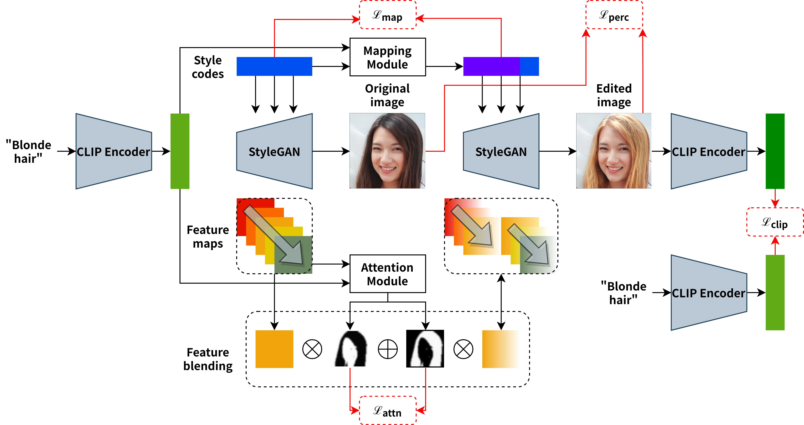

## Where You Edit is What You Get: Text-Guided Image Editing with Region-Based Attention

This repository contains the official PyTorch implementation of our *Pattern Recognition* journal paper:

> **Where You Edit is What You Get: Text-Guided Image Editing with Region-Based Attention**<br>
> Changming Xiao, Qi Yang, Xiaoqiang Xu, Jianwei Zhang, Feng Zhou, Changshui Zhang <br>
> https://doi.org/10.1016/j.patcog.2023.109458 <br>
>
>**Abstract:** Leveraging the abundant knowledge learned from pre-trained multi-modal models like CLIP has recently proved to be effective for text-guided image editing. Though convincing results have been made when combining the image generator StyleGAN with CLIP, most methods need to train separate models for different prompts, and irrelevant regions are often changed after editing due to the lack of spatial disentanglement. We propose a novel framework that can edit different images according to different prompts in one model. Besides, an innovative region-based spatial attention mechanism is adopted to explicitly guarantee the locality of editing. Experiments mainly in the face domain verify the feasibility of our framework and show that when multi-text editing and local editing are accomplishable, our method can complete practical applications like sequential editing and regional style transfer.

<div align=center>

</div>

## To Start

The Conda environment is in "requirements.txt". The main folder is the "attention" folder, and "train_scripts.sh" has commands to run the codes. 

You should run "clustering_feature.py" first to generate the clusters, then run "run_attention.py" can do the training. 

The "pretrained_models" folder is used to store pre-trained models and the "celeba-caption" folder is used to store the corpus.

We have provided scripts in the "show_demo" folder to run a demo.

## Citation

If you find our research interesting, please kindly cite our paper:

```
@article{where2edit,
title = {Where you edit is what you get: Text-guided image editing with region-based attention},
journal = {Pattern Recognition},
volume = {139},
pages = {109458},
year = {2023},
issn = {0031-3203},
author = {Changming Xiao and Qi Yang and Xiaoqiang Xu and Jianwei Zhang and Feng Zhou and Changshui Zhang},
}
```
